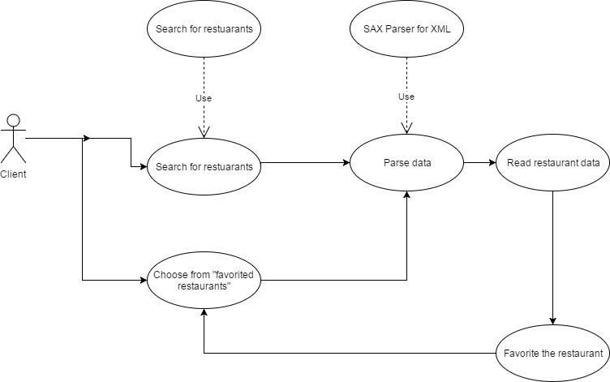

# DineSafeTO

DineSafeTO is an android app that allows users to query for food inspection data from http://www1.toronto.ca/wps/portal/contentonly?vgnextoid=b54a5f9cd70bb210VgnVCM1000003dd60f89RCRD. The purpose of this project was to make the data inside the dinesafe.xml provided by DineSafe Toronto more accessible to consumers. 

<h2>UML Use Case</h2>

<h2>UML Class Diagram</h2>
<a href="https://go.gliffy.com/go/publish/12063896">Link to Gliffy</a>

<h2>Database</h2>
<a href="https://github.com/alainlou/DineSafeDB">Link to Data Processing and IBM Cloudant Client</a>
